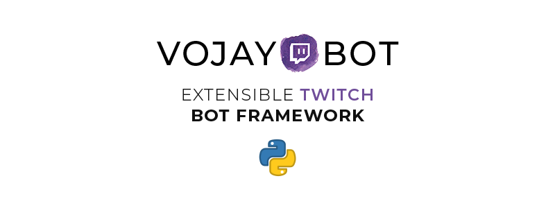
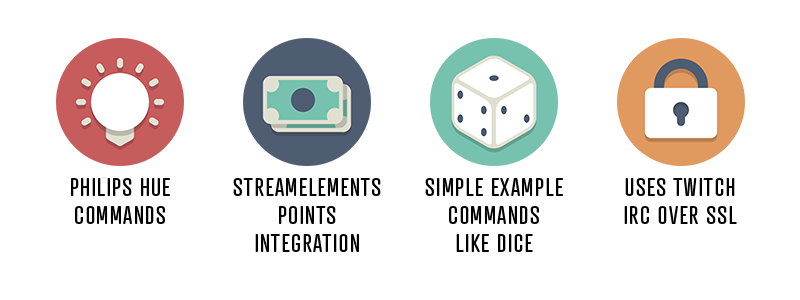

Hi there, this is an extensible and modular Twitch chat bot and framework based on Python. This was creating during
my live streams on Twitch. Basically it holds a full featured, configurable chat bot that I use myself but the
components of it are easily usable to implement your own bot based on it.

This is a living document and I am in the progress of writing an introduction on how to use it for your Twitch projects.
